# Prism Dashboard

**Your music sets the mood of your desktop.**

Album artwork colors the player, the controls, and the clock. Dots drift across
its cover, soft waves flow behind it, and a liquid bubble chases your cursor.
Open the clock to bring your music, calendar, and local weather into one panel.

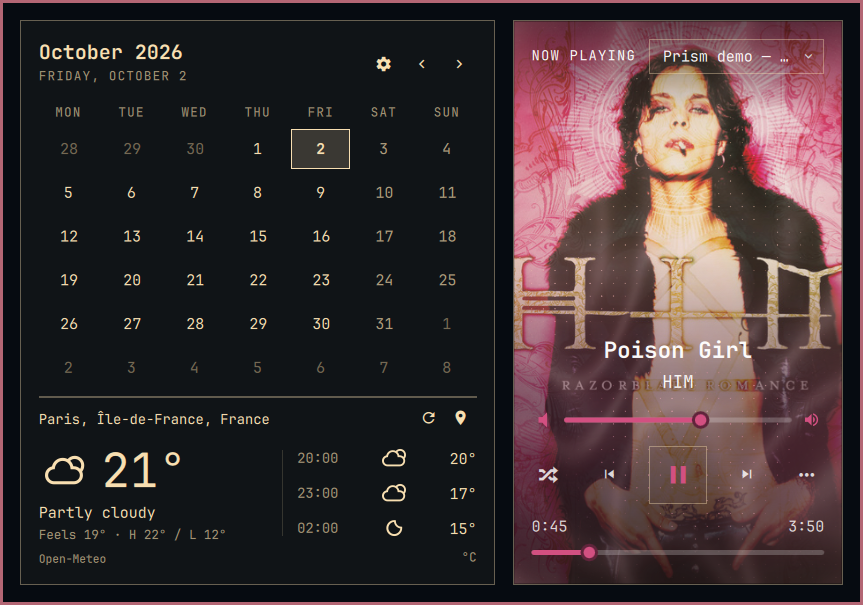

## See every feature

Animated features have looping previews and links to silent MP4 recordings.
The gallery uses Poison Girl by HIM, Paris demo weather, and isolated player
fixtures. [Capture details and credits](docs/credits.md).

### Color that follows the artwork

The cover sets the player's accent, sliders, hover states, and clock spectrum.
A shared sampler keeps them in step. A diagonal glow draws color through the
artwork, while darker shading keeps the title and controls readable.

This recording switches between cover colors and the Omarchy theme accent.
The chosen song and cover stay the same.

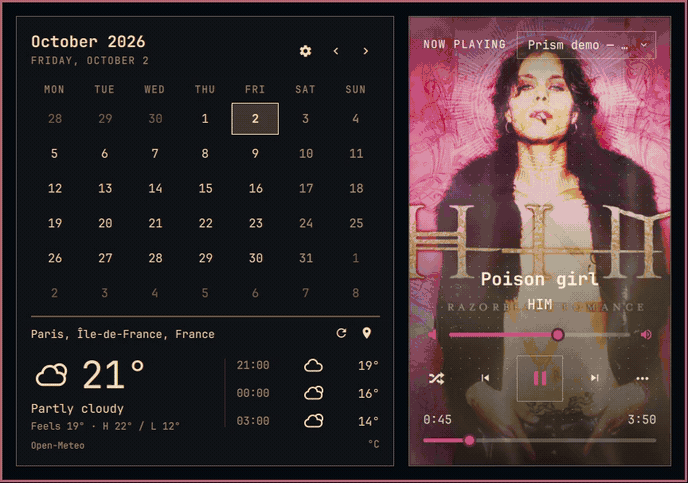

[Watch the MP4 recording](docs/media/dynamic-colors.mp4)

### A field of drifting dots

Small dots form moving clusters across the player. They drift from different
places instead of repeatedly starting at the center. The denser field gives
motion to the whole cover.

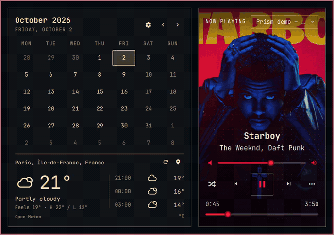

[Watch the MP4 recording](docs/media/dots.mp4)

### Soft waves behind the music

Broad waves move through the cover's colors. Dots and waves have separate
switches, so you can choose either effect or combine them.

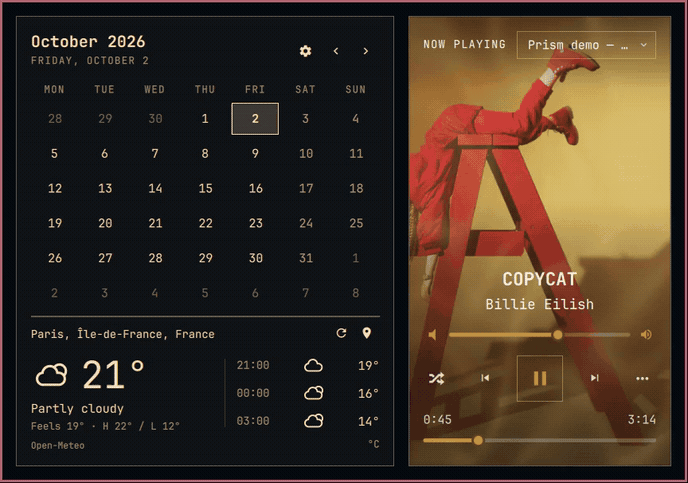

[Watch the MP4 recording](docs/media/waves.mp4)

### A liquid trail that catches up

The hover bubble follows a spring. It lags behind, accelerates toward your
cursor, overshoots, and settles back. Two trailing points stretch it into a
fluid shape rather than a rigid pointer highlight.

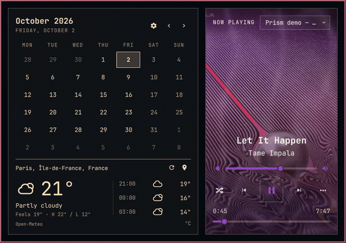

[Watch the MP4 recording](docs/media/liquid-hover.mp4)

Music animations freeze and fade away when the selected player pauses.

### The clock becomes a visualizer

CAVA reads the PipeWire audio output and draws 22 bands behind the clock. Its
accent follows the cover. Audio energy also feeds the player's moving dots.
The clock remains usable if CAVA is missing.

Right-click the clock to cycle Omarchy's formats. Your choice survives a
restart. Vertical bars have their own stacked formats.


[Watch the MP4 recording](docs/media/clock.mp4)

The clock recording uses controlled demo band levels to make the renderer and
format changes visible. Normal use reads real audio through CAVA.

### A calendar beside your music

The calendar starts weeks on Monday, highlights today, and lets you move
between months. Weather stays current when you browse another month.

The player supports previous, play/pause, next, per-app volume, and seeking.
Unavailable controls are disabled. The source selector distinguishes media
sources and hides duplicate browser aggregates when their URLs match.

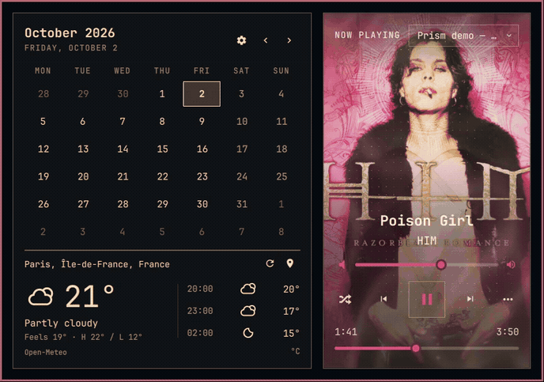

[Watch the MP4 recording](docs/media/playback.mp4)

### Spotify likes that stay liked

An outline heart adds the displayed song to Liked Songs. A filled heart means
it is already saved. Clicking it leaves the song saved. The dashboard checks
the track identity and waits for Spotify to confirm the save.

Ads, episodes, local files, and unsupported content have no Spotify heart.
The optional Spicetify extension uses Spotify's existing login.

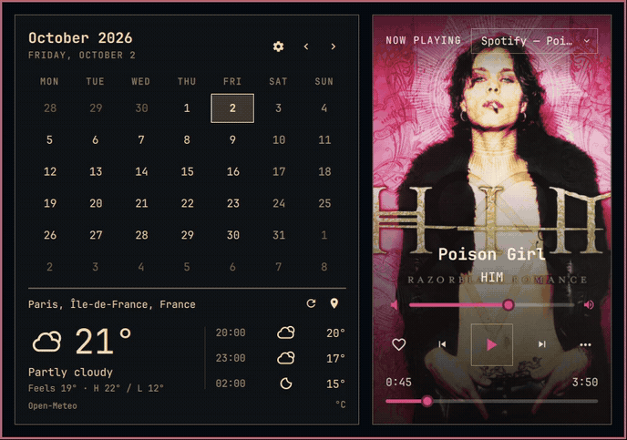

| Not saved | Already in Liked Songs |
|---|---|
| 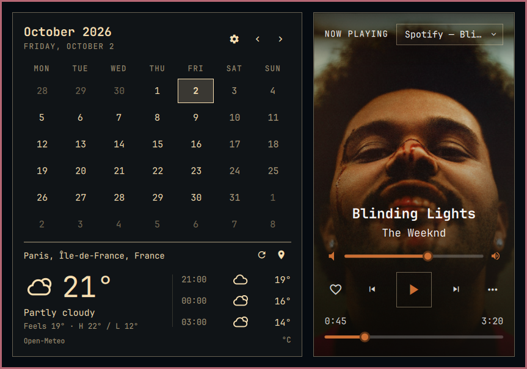 | 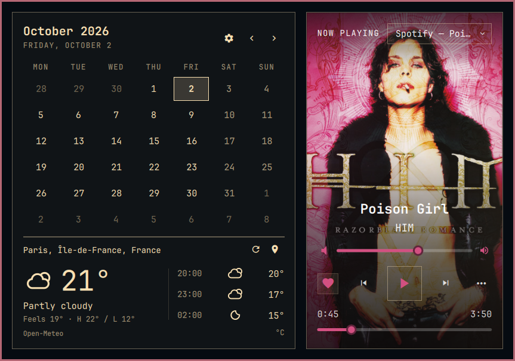 |

[Watch the MP4 recording](docs/media/spotify-like.mp4) ·
[Enable the Spotify heart](docs/setup.md#spotify-heart)

The side menu exposes supported shuffle and repeat, plus an action to open the
player. Repeat cycles through Off, All, and Song.

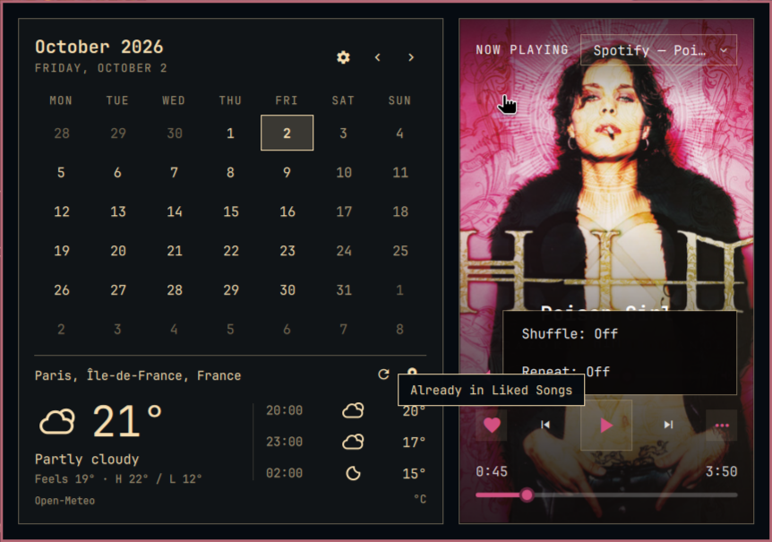

### Buttons that match the provider

Podcasts get back 15 seconds and forward 30 seconds when seeking is available.
Browser media gets a button to open its original page. These actions depend on
what the source reports through MPRIS.


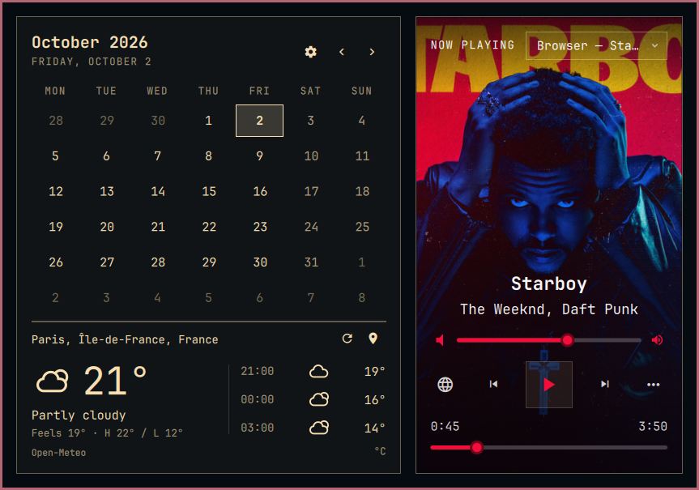

### Weather for the right place

Current temperature, conditions, feels-like temperature, daily range, and
upcoming hours sit beneath the calendar. The layout leaves room for a large
weather icon without making the panel taller.

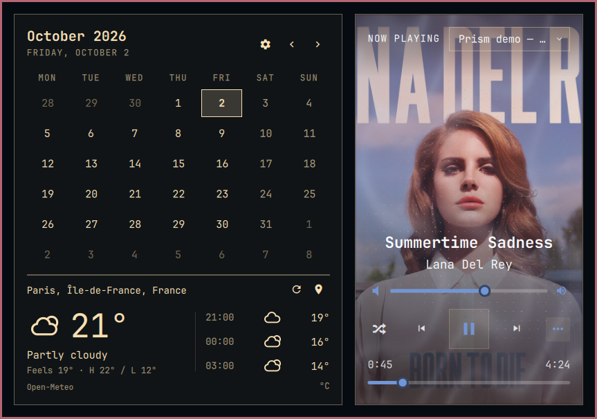

Choose Celsius or Fahrenheit in settings. A refresh button requests new data.
Failed updates retain the last successful forecast and mark it as stale.

### Choose a city with confidence

Search a city or postal code. Add a country to narrow it down. Results show
region and country so you can choose the correct place, and the picker saves
confirmed coordinates. Local scripts are supported where Photon has coverage.
The location is shared with Omarchy's weather settings.

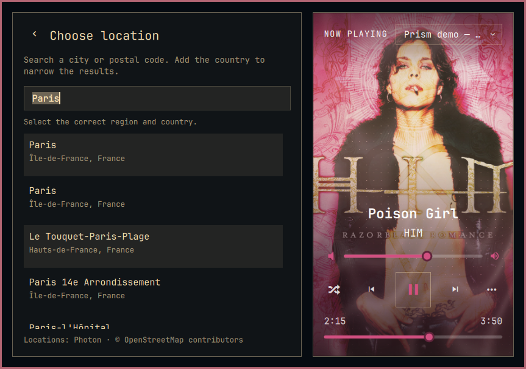

[Watch the location-picker recording](docs/media/location.mp4)

### Simple switches, immediate results

The gear beside the month arrows opens a scrolling settings pane. The music
card stays visible so you can see what each switch changes.

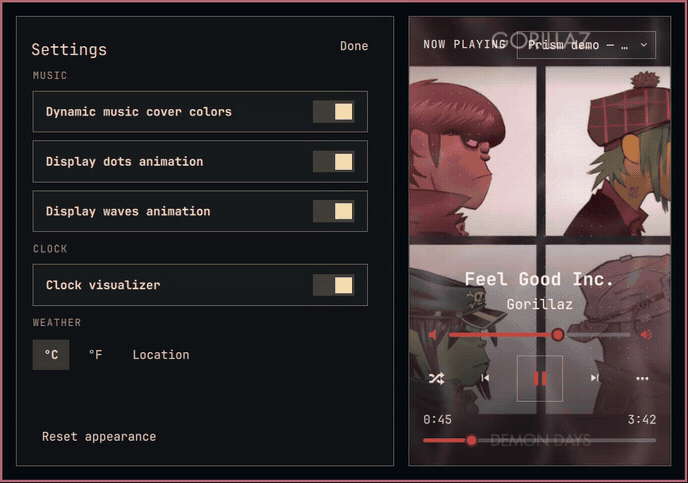

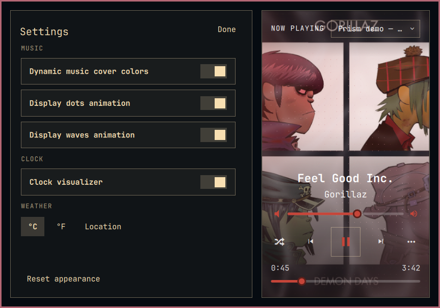

[Watch the MP4 recording](docs/media/settings.mp4)

The switches control dynamic music cover colors, dots, waves, and the clock
visualizer. Weather units and location are here too. Reset appearance restores
the visual defaults and keeps your clock formats and weather preferences.

## Install

Prism runs inside the current Omarchy Shell. It needs Quickshell, `curl`, and an
Omarchy font with Nerd Font icons. The compiled shaders are included.

Install from the public repository:

```bash
omarchy plugin add https://github.com/sadraalikhah/prism-dashboard.git
omarchy plugin enable io.github.sadraalikhah.prism-dashboard --section center
```

Prism has its own plugin ID, `io.github.sadraalikhah.prism-dashboard`, and leaves
other plugins in place. If another clock is already on the bar, use the
[migration guide](docs/setup.md#migrate-from-another-clock) to replace its entry
and preserve your clock preferences.

CAVA is optional for the audio spectrum. The Spotify heart additionally needs
Spicetify, Python, PyGObject, and Soup 3. Playback and weather work without those
optional integrations.

[Setup, Spotify installation, preferences, and troubleshooting](docs/setup.md)

## Use it

Click the clock to open Prism. Right-click it to change the format. Use the
month arrows for the calendar and the map pin for your weather location. The
player's source selector appears when several media sources are available.
The gear opens settings. Escape closes the panel.

## Remove

```bash
omarchy plugin remove io.github.sadraalikhah.prism-dashboard
```

If Prism replaced another clock, restore that clock entry and `centerAnchor`.
Disable the optional Spicetify extension separately, as described in the
[setup guide](docs/setup.md#spotify-heart).

## Project layout

- `src/`: dashboard widgets, clock, weather, colors and settings.
- `src/shaders/`: animation shaders and compiled versions.
- `integrations/spotify/`: Spotify extension and local bridge.
- `tests/`: unit, provider and QML interaction checks.
- `tools/`: gallery capture tools and demo fixtures.
- `docs/`: guides, release notes, screenshots and recordings.

## Built on Omarchy

Prism Dashboard is Sadra Alikhah's edition of
[cucu0628's Omarchy Dashboard](https://github.com/cucu0628/omarchy-dashboard).
It uses Omarchy's own typography, borders, and theme colors. Turn dynamic cover
colors off to use your desktop accent throughout the player and clock.

The source is [MIT licensed](LICENSE). Weather comes from
[Open-Meteo](https://open-meteo.com/), and location search uses
[Photon](https://github.com/komoot/photon) and
[OpenStreetMap contributors](https://www.openstreetmap.org/copyright).
See [data and capture credits](docs/credits.md).

[Development and checks](docs/development.md) · [Changes](CHANGELOG.md)
